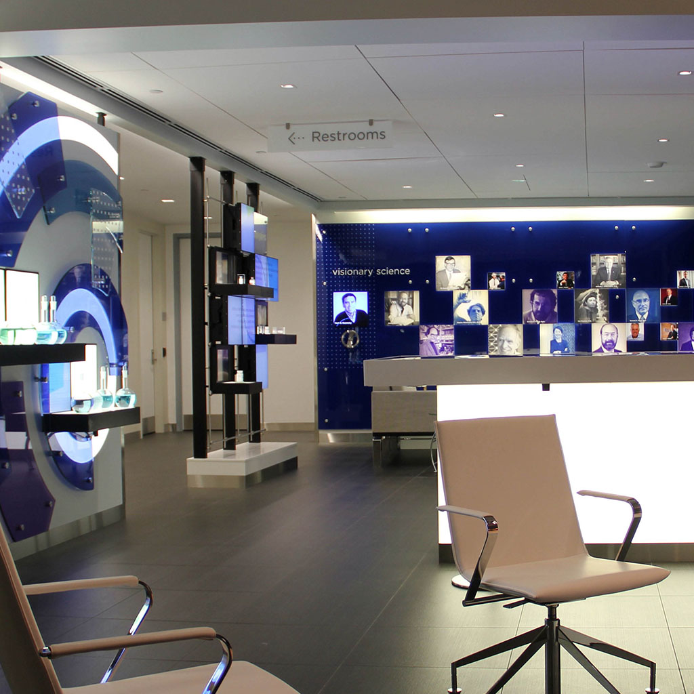

<!-- Main -->

<!-- Two -->
<section id="two" class="spotlights">
	<section>
		
		

			

				<header class="major">
					<h3>Boston Public Library</h3>
				</header>
				
This major, three-part installation in the Johnson Building of the Boston Public Library aims to reveal the Library's digital holdings, the movement of materials and people, and the many programs that take place each day throughout the library system. I led the overall development of this project. I am especially proud of our work building a dynamic image tiling and loading system to display scans of over 100,000 items at full resolution and a computer vision system that sketches patrons' faces with lines from classic books.

				<ul class="actions">
					<li><a href="http://smalldesignfirm.com/project/welcome-center/" class="button">Welcome Center</a></li>
					<li><a href="http://smalldesignfirm.com/project/digital-stacks/" class="button">Digital Stacks</a></li>
					<li><a href="http://smalldesignfirm.com/project/digital-signage/" class="button">Signage</a></li>
				</ul>
			

		

	</section>
	<section>
		
		

			

				<header class="major">
					<h3>New-York Historical Society</h3>
				</header>
				
In 2011 I helped develop an early "AR" system that recreated a wall covered in over 100 art objects. In 2017 I worked on a monumental touch screen wall that connects the lives and work of important women in New York's history. I developed a graphing system, typography animations and a suite of shaders for that application. Also in 2017, I designed and built a 3D printed armature that precisely holds nearly 1,000 individually controllable LEDs inside a Tiffany-style lampshade. Using the shade and a series of sensors visitors can simulate the process of choosing and composing lamp designs. All input and interaction for this project is done directly through manipulating physical objects, creating a sense of magic and direct control.

				<ul class="actions">
					<li><a href="http://smalldesignfirm.com/project/design-a-lamp/" class="button">Design-a-Lamp</a></li>
					<li><a href="http://smalldesignfirm.com/project/womens-voices/" class="button">Women's Voices</a></li>
					<li><a href="http://smalldesignfirm.com/project/new-york-rising/" class="button">New York Rising</a></li>
				</ul>
			

		

	</section>
	<section>
		
		

			

				<header class="major">
					<h3>Biogen</h3>
				</header>
				
I led the spatial redesign and interactive development for Biogen's world headquarters lobby. Each interactive is relatively straightforward in form an purpose: an RFID object table, a wall of talking heads, furniture with embedded displays, etc. Together they form a coherent and coordinated spatial experience. Graphics on screen spill on to adjacent walls and furniture and monumental graphics are continued across multiple installations.

				<ul class="actions">
					<li><a href="http://smalldesignfirm.com/project/our-pipeline/" class="button">Our Pipeline</a></li>
					<li><a href="http://smalldesignfirm.com/project/smart-energy/" class="button">Smart Energy</a></li>
					<li><a href="http://smalldesignfirm.com/project/facets-of-history/" class="button">Facets of History</a></li>
				</ul>
			

		

	</section>
	<section>
		
		

			

				<header class="major">
					<h3>Dana Farber Cancer Research Institute</h3>
				</header>
				
For this project I designed and built a system to generate a school of over 450 zebrafish 3D prints. Each fish includes mounting geometry for a lighting and sensor board. Networked together, they form a dynamic display celebrating the contributions of DFCI's research and the support of their many friends, family and patients.

				<ul class="actions">
					<li><a href="http://smalldesignfirm.com/project/zebrafish/" class="button">Zebrafish Wall</a></li>
				</ul>
			

		

	</section>
</section>

