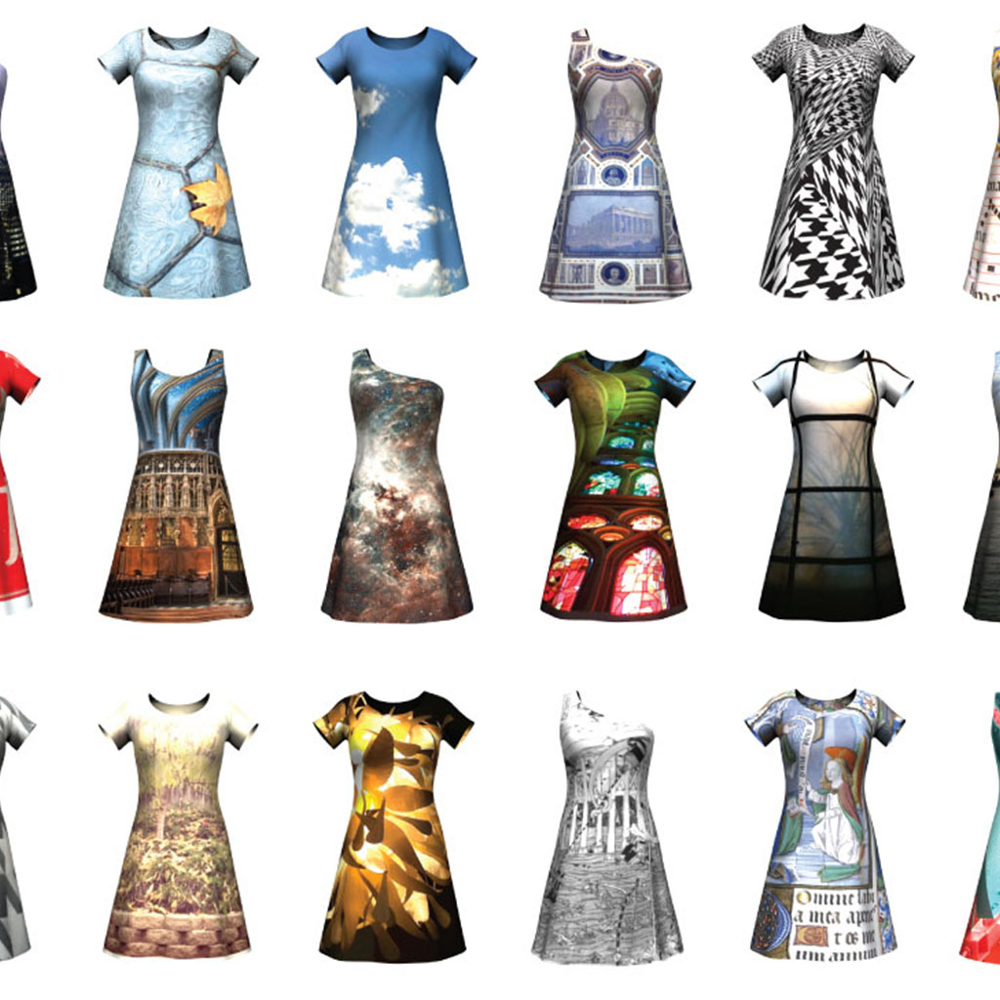
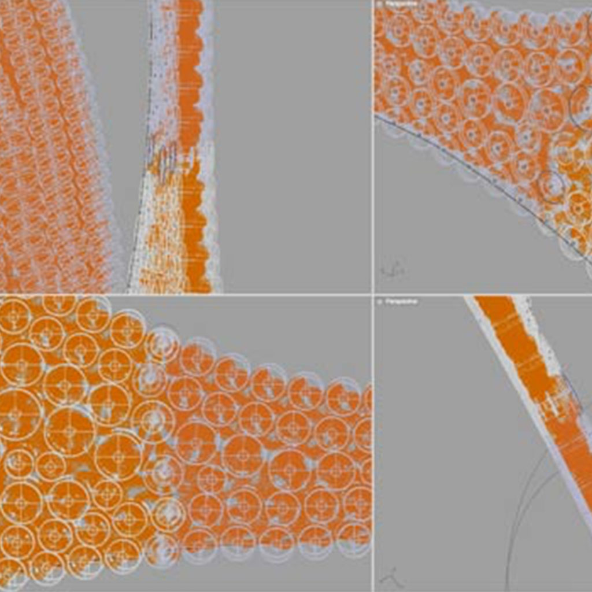

<!-- Main -->

<!-- Two -->
<section id="two" class="spotlights">
	<section></section>
	<section>
		

		

		

			

				<header class="major">
					<h3>Evelyn & Bobbie</h3>
				</header>
				
EB wants to change the way intimate apparel is designed, sized and sold. Using material technology, more explicit grading and new structural approaches, EB strives to create meaningful, human-driven products that solve our customers' everyday needs. I've worn many hats at Evelyn & Bobbie. My projects there have ranged from a scrappy Kinect-based 3D body scanning and analysis system to running a custom 3PL fulfillment server.

				<ul class="actions">
					<li><a href="https://evelynbobbie.com/" class="button">Site</a></li>
				</ul>
			

		

	</section>
	<section>
		
		

			

				<header class="major">
					<h3>CONSTRVCT</h3>
				</header>
				
A collaboration with Mary Huang, this was my first major foray into e-commerce. I developed an automated 3D sizing, pattern generation and print-ready file preparation system. Together we built a web platform that allowed our customers to visualize their garments in real time 3D in their size and image or graphic pattern.

				<ul class="actions">
					<li><a href="http://www.continuumfashion.com/constrvct.php" class="button">Documentation</a></li>
					<li><a href="https://www.kickstarter.com/projects/rhymeandreason/constrvct-design-your-own-fashion" class="button">Kickstarter</a></li>
				</ul>
			

		

	</section>
	<section>
		
		

			

				<header class="major">
					<h3>N12</h3>
				</header>
				
My first major collaboration with Mary Huang, the N12 was the world's first 3D printed textile system. I developed a circle packing algorithm that responds to load, curvature, coverage and stretch requirements.

				<ul class="actions">
					<li><a href="http://www.continuumfashion.com/N12.php" class="button">Documentation</a></li>
				</ul>
			

		

	</section>
</section>

