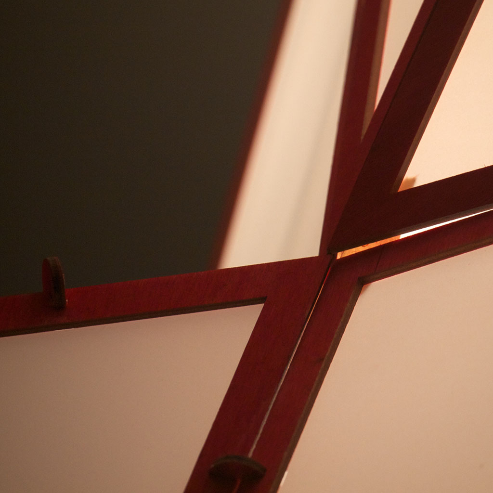
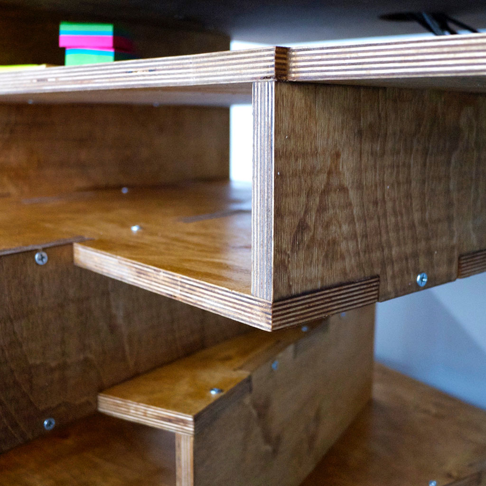
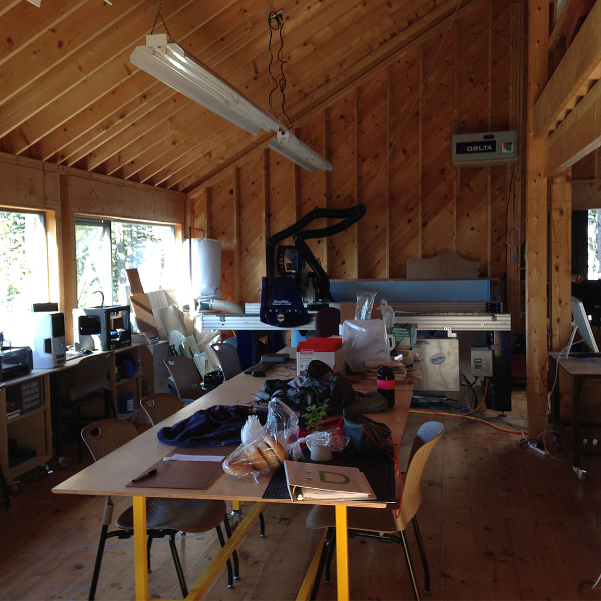

<!-- Main -->

<!-- Two -->
<section id="two" class="spotlights">
	<section>
		
		

			

				<header class="major">
					<h3>Lighting</h3>
				</header>
				
Many of my long running design ideas lend themselves well to light fixtures. Using locally availble laser cutters, my trusty craft robo pro and bits of code I've created three light fixture collections.

				<ul class="actions">
					<li><a href="https://www.instructables.com/id/Triangulated-Lamps/" class="button">Triangles</a></li>
					<li><a href="https://www.flickr.com/photos/jftesser/sets/72157647070889114" class="button">Zippers</a></li>
					<li><a href="https://www.flickr.com/photos/jftesser/sets/72157628652038249" class="button">Curve Folds</a></li>
				</ul>
			

		

	</section>
	<section>
		
		

			

				<header class="major">
					<h3>Furniture</h3>
				</header>
				
Whenever I get access to a large scale CNC machine I try to make a new piece of furniture. I've built desks, tables and a home for my laser printer.

				<ul class="actions">
					<li><a href="https://www.flickr.com/photos/jftesser/sets/72157648422616639" class="button">Desk</a></li>
					<li><a href="https://www.flickr.com/photos/jftesser/sets/72157646510455473" class="button">Dining Table</a></li>
					<li><a href="https://www.flickr.com/photos/jftesser/sets/72157630795318272" class="button">End Table</a></li>
				</ul>
			

		

	</section>
	<section>
		
		

			

				<header class="major">
					<h3>Haystack Fab Lab</h3>
				</header>
				
I volunteer at the Haystack Fab Lab most summers. There I help artists and makers explore how digital fabrication tools can be applied to their own work. I've taught people to use a laser cutter for the first time, start 3D modeling and translate hand drawings into g-code.

				<ul class="actions">
					<li><a href="https://www.haystack-mtn.org/programs/fab-lab/" class="button">Learn more</a></li>
				</ul>
			

		

	</section>
</section>

